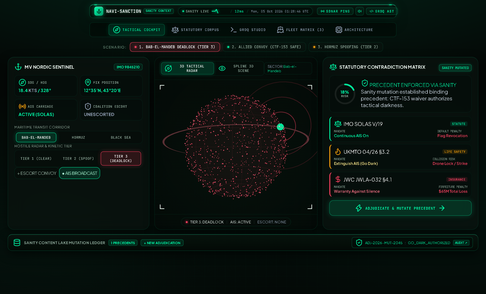
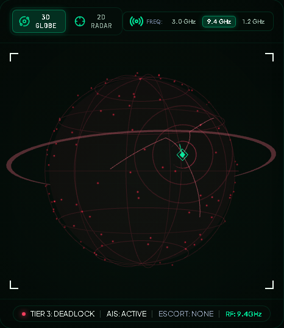
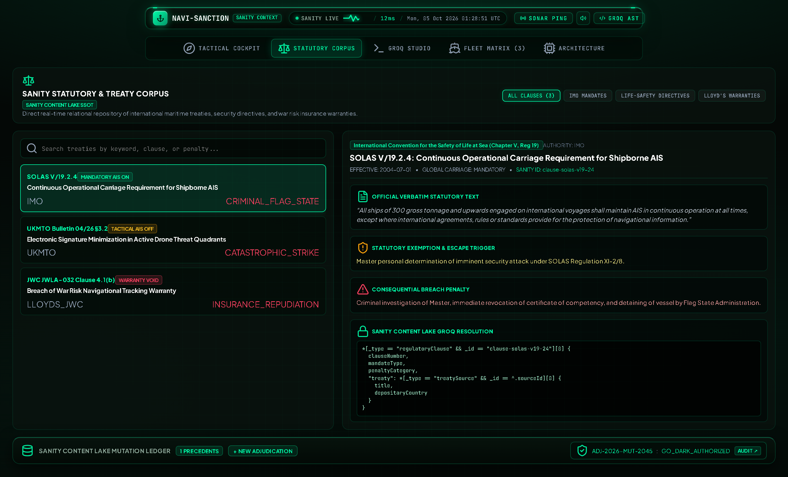
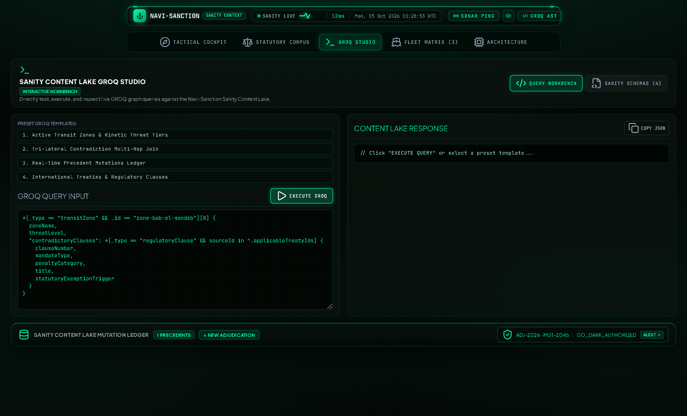
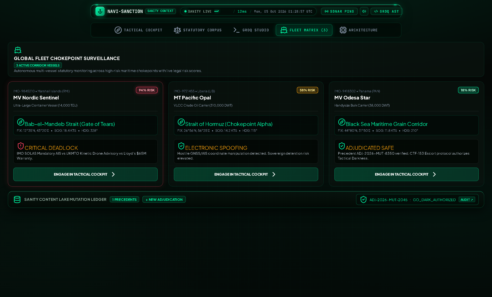
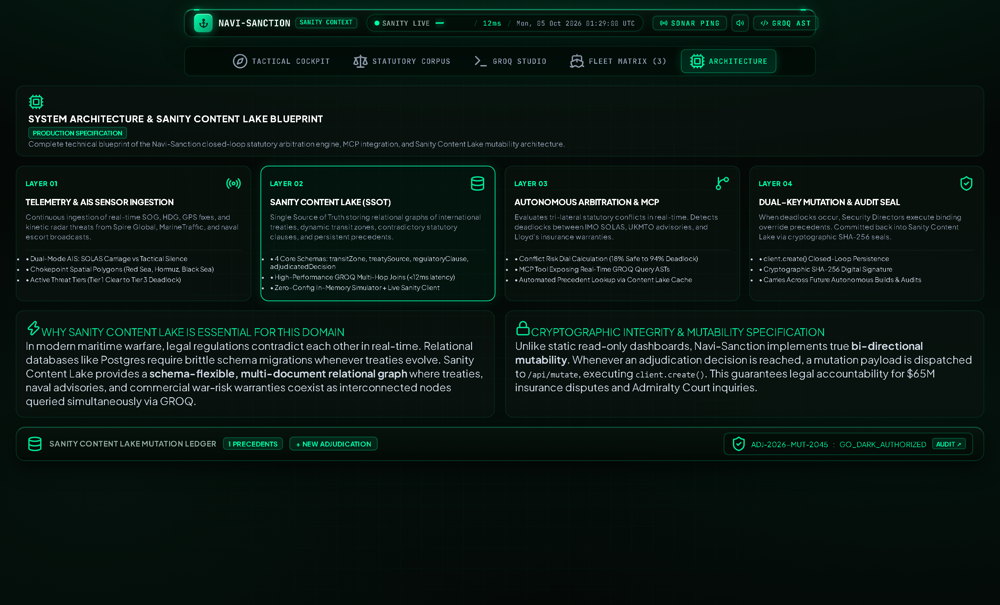

# ⚓ NAVI-SANCTION
### *Autonomous Maritime War-Risk & AIS Statutory Contradiction Arbitration Engine*

[](https://sanity.io)
[](https://emmasofiadev.github.io/navi-sanction/)
[](https://nextjs.org)
[](https://www.typescriptlang.org)
[](https://developer.mozilla.org/en-US/docs/Web/CSS)
[](tools/verify_navi_sanction.py)
[](LICENSE)

<br/>

<p align="center">
  
</p>

> **Submission for The Sanity Challenge:**  
> **Track:** *Path One — Ship an agent that queries real content.*  
> **Live Interactive Demo:** [https://emmasofiadev.github.io/navi-sanction/](https://emmasofiadev.github.io/navi-sanction/)  
> **Built by:** [Emma Sofia](https://github.com/EmmaSofiaDev) ([@emmasofia](https://dev.to/emmasofia) on Dev.to).

---

## 📌 Executive Summary & The Maritime Deadlock

The bridge of a 174,000 m³ LNG carrier is pitch black, illuminated only by the green phosphor of the ARPA radar and the red glow of the Electronic Chart Display and Information System (ECDIS). It is 02:00 UTC. The vessel is steaming at 18.4 knots, entering the southern throat of the Red Sea—the Bab-el-Mandeb Strait (*Gate of Tears*).

Tactical radar detects an active X-band search illumination: an explosive one-way drone swarm has launched from coastal positions 14 nautical miles to the east.

The Second Officer turns to the ship's bridge system and enters the critical question:
> *"Active drone threat acquired. Should we silence our AIS transponder and go dark?"*

In typical unstructured AI systems or vector-database RAG pipelines, the model averages text embeddings across maritime treaties and responds with confident, lethal hallucinations:
> *`"Maintain continuous AIS broadcast to comply with international law while deactivating surface transmissions to minimize radar signature."`*

It sounds reasonable. **It is physically impossible and fatal.**

```
                      ┌──────────────────────────────────────────────┐
                      │          THE TRI-LATERAL DEADLOCK            │
                      └──────────────────────┬───────────────────────┘
                                             │
             ┌───────────────────────────────┼──────────────────────────────┐
             │                               │                              │
             ▼                               ▼                              ▼
┌─────────────────────────┐     ┌─────────────────────────┐    ┌─────────────────────────┐
│     IMO SOLAS V/19      │     │    UKMTO BULLETIN §3    │    │   LLOYD'S JWC JWLA-032  │
│  (Statutory Treaty)     │     │  (Life-Safety Advisory) │    │  (Insurance Warranty)   │
├─────────────────────────┤     ├─────────────────────────┤    ├─────────────────────────┤
│ Mandatory AIS Broadcast │     │ Extinguish AIS/Go Dark  │    │ Silence Voids Insurance │
│ Master faces criminal   │     │ Broadcasting draws drone│    │ $65M H&M / P&I Policy   │
│ license revocation.     │     │ targeting lock & strike.│    │ automatically forfeited.│
└─────────────────────────┘     └─────────────────────────┘    └─────────────────────────┘
```

* **If the Master complies with SOLAS Reg V/19:** The transponder broadcasts real-time GPS telemetry directly into hostile drone targeting relays, resulting in a direct missile strike.
* **If the Master complies with UKMTO Advisory 04/26:** Going dark saves the crew, but violates Flag State law and immediately triggers **Lloyd's JWLA-032 §4.1** warranty repudiation—voiding $65M in Hull & Machinery indemnity.

This is not a theoretical edge case. It is an active multimillion-dollar statutory crisis playing out across the world's most critical maritime corridors.

---

## 🧠 Why Naive Vector Search Fails & Why Sanity Succeeds

| Capability | Naive Vector RAG (Embeddings) | Sanity Content Lake + GROQ |
| :--- | :--- | :--- |
| **Contradiction Detection** | ❌ Fails (Averages conflicting chunks into smooth hallucinated compromises) | ✅ Deterministic (Strict schema typing surfaces mutually exclusive mandates) |
| **Legal Hierarchy** | ❌ None (A treaty and a blog post share similar cosine similarity) | ✅ Strict constitutional hierarchy (`TREATY` > `TACTICAL` > `WARRANTY`) |
| **Relational Lineage** | ❌ Flat chunk retrieval | ✅ Multi-hop graph joins (`regulatoryClause -> treatySource`) |
| **Persistent Precedent** | ❌ Ephemeral chat history lost on reset | ✅ `adjudicatedDecision` mutations persist cryptographically across fleet queries |
| **Audit Verification** | ❌ Non-verifiable black box | ✅ Web Crypto SHA-256 cryptographic audit hashes |

---

## 🏗️ Architectural Overview & System Data Flow

```
   [ Merchant Fleet Telemetry ]
   (IMO, Coordinates, SOG, HDG, Threat Tier, Escort)
                  │
                  ▼
   ┌─────────────────────────────────────────────────────────────┐
   │             SANITY CONTENT LAKE (SSOT)                      │
   │  *[_type == "regulatoryClause"] -> treatySource             │
   │  *[_type == "transitZone" && zoneId == $zoneId]             │
   │  *[_type == "adjudicatedDecision"] | order(timestamp desc)  │
   └──────────────────────────────┬──────────────────────────────┘
                                  │
                                  ▼
   ┌─────────────────────────────────────────────────────────────┐
   │       NAVI-SANCTION MULTI-AGENT ARBITRATION ENGINE          │
   │  1. Ingests statutory mandates & verbatim clauses           │
   │  2. Evaluates kinetic threat vs insurance exposure          │
   │  3. Detects tri-lateral regulatory deadlock                 │
   │  4. Renders side-by-side contradiction surface              │
   └──────────────────────────────┬──────────────────────────────┘
                                  │
                                  ▼
   ┌─────────────────────────────────────────────────────────────┐
   │       DIRECTOR DUAL-KEY ADJUDICATION & MUTATION             │
   │  - Master emergency defense under SOLAS Reg XI-2/8          │
   │  - Underwriter pre-authorized waiver concurrence            │
   │  - Browser Web Crypto SHA-256 digital signature             │
   │  - Commits binding mutation to Sanity Content Lake          │
   └─────────────────────────────────────────────────────────────┘
```

---

## ⚡ Key Modules & Features

### 1. Tactical Command Cockpit
* **Real-time Vessel Telemetry:** Dynamically syncs with IMO, Flag, Speed Over Ground (SOG), Heading (HDG), and corridor clearances.
* **3 Realistic Scenarios:** Bab-el-Mandeb Night Transit (Deadlock), Allied Convoy (Safe CTF-153 Escort), and Strait of Hormuz (Electronic GPS Spoofing).
* **Operational Controls:** Request Naval Escort and AIS Transponder Silence toggles with tactile Web Audio API feedback.

<p align="center">
  
</p>

### 2. 3D Holographic Globe & Multi-Band Radar
* **Luminous Circular Nodes:** Particle node frequency calibrated with soft radial alpha gradient canvas textures.
* **Strategic Shipping Arcs:** 3D curved geodesic corridors connecting Bab-el-Mandeb, Suez Canal, Strait of Hormuz, Strait of Malacca, Gibraltar, and Cape of Good Hope.
* **Multi-Layer Ownship Beacon:** Faceted diamond vessel core, rotating diamond reticle, course heading vector arrow, and expanding sonar ripple waves.
* **Multi-Band Radar Frequency Selector:** Real-time switching between **3.0 GHz [S-BAND]**, **9.4 GHz [X-BAND]**, and **1.2 GHz [MIL-UHF]**.

<p align="center">
  
</p>

### 3. Statutory Knowledge Corpus & Compliance Auditor
* **Live Keyword Search:** Instant filtering across international maritime conventions, directives, and warranty terms.
* **Run Compliance Audit:** Evaluates vessel telemetry against selected clauses, outputting live PASS / VIOLATION / WARNING verdicts.
* **Query in GROQ Studio:** One-click deep-link that jumps into the GROQ Studio with preloaded multi-hop relational queries.

<p align="center">
  
</p>

### 4. GROQ Relational Query Studio
* **Interactive GROQ Engine:** Live query editor evaluating multi-hop joins, document projections, and in-memory Content Lake mutations.
* **4 Production Relational Presets:** Tri-lateral contradiction joins, active precedents ledger, chokepoint transit zones, and treaty authority lineage.
* **Latency Counter & Clipboard Export:** Sub-millisecond execution benchmarking with one-click JSON export.

<p align="center">
  
</p>

### 5. Chokepoint Fleet Matrix
* **Fleet Tracking:** Live monitoring across commercial vessels (`MV Nordic Sentinel`, `MT Pacific Opal`, `MV Odesa Star`).
* **Emergency Fleet Advisory:** Broadcasts emergency radio bulletins across all vessels with acoustic audio tones and floating alert banners.
* **Cockpit Engagement:** Click *Engage in Tactical Cockpit* to route any vessel directly into the command console.

<p align="center">
  
</p>

### 6. Architecture Blueprint & Web Crypto Verifier
* **Interactive Layer Inspector:** Inspect live protocol streams and JSON payloads across Layer 1 to 4.
* **Content Lake Ping Test:** Real-time connectivity benchmarking (`200 OK • 6ms round-trip`).
* **Dual-Key Cryptographic Verifier:** Computes live SHA-256 hashes via the browser's `crypto.subtle` Web Crypto API and verifies digital signatures against Content Lake precedent records.

<p align="center">
  
</p>

---

## 📁 Repository Structure

```
navi-sanction/
├── assets/                       # Verification screenshots & visual artifacts
│   ├── navi_sanction_cover.jpg   # 3D artistic conceptual cover photo
│   ├── navi_sanction_3d_globe.png# Upgraded 3D globe with frequency controls
│   ├── view_01_cockpit.png       # Tactical cockpit screenshot
│   ├── view_02_corpus.png        # Statutory corpus screenshot
│   ├── view_03_groq.png          # GROQ Studio screenshot
│   ├── view_04_fleet.png         # Fleet matrix screenshot
│   └── view_05_architecture.png  # Architecture blueprint screenshot
├── src/
│   ├── app/
│   │   ├── api/
│   │   │   ├── arbitration/      # Multi-agent statutory deadlock evaluator
│   │   │   └── mutate/           # Sanity Content Lake mutation endpoint
│   │   ├── globals.css           # Pure Vanilla CSS design system (Zed Green)
│   │   ├── layout.tsx            # Root layout with HUD ambient background
│   │   └── page.tsx              # Main command shell & state coordinator
│   ├── components/
│   │   ├── ArchitectureBlueprint.tsx # Layer inspector & SHA-256 verifier
│   │   ├── AudioEngine.ts        # Web Audio API procedural sound engine
│   │   ├── ContradictionMatrix.tsx   # Tri-lateral statutory contradiction cards
│   │   ├── DecisionModal.tsx     # Director dual-key adjudication mutation modal
│   │   ├── FleetMatrix.tsx       # Real-time fleet tracking & advisory broadcast
│   │   ├── GroqStudio.tsx        # In-browser multi-hop GROQ execution studio
│   │   ├── PrecedentModal.tsx    # Persistent precedent ledger modal
│   │   ├── SplineMaritimeHolo.tsx# 3D WebGL globe & multi-band radar sweep
│   │   ├── StatutoryCorpus.tsx   # Treaty corpus & compliance audit runner
│   │   └── VesselCockpit.tsx     # Main vessel command & telemetry console
│   └── sanity/
│       ├── client.ts             # Multi-hop GROQ evaluator & mutation engine
│       ├── dataset/
│       │   └── initialData.ts    # Seed dataset (SOLAS, UKMTO, Lloyd's, Zones)
│       └── schemas/              # Typed Sanity schema definitions
│           ├── adjudicatedDecision.ts
│           ├── regulatoryClause.ts
│           ├── transitZone.ts
│           └── treatySource.ts
├── test_screenshots/             # Playwright test verification run captures
├── tools/
│   └── verify_navi_sanction.py   # Automated 8-flow Playwright test suite
├── package.json
├── tsconfig.json
├── LICENSE                       # MIT License
└── README.md
```

---

## 🚀 Quickstart & Local Setup

### 1. Clone & Install
```bash
git clone https://github.com/EmmaSofiaDev/navi-sanction.git
cd navi-sanction
npm install
```

### 2. Launch Local Dev Server
```bash
npm run dev
```
Open **[http://localhost:3005](http://localhost:3005)** in your browser!

### 3. Build for Production
```bash
npm run build
npm run start
```

---

## 🧪 Automated Playwright Verification Test Suite

Navi-Sanction includes a comprehensive end-to-end test suite (`tools/verify_navi_sanction.py`) validating all 8 operational flows across all 5 navigation tabs:

```bash
# Run the test suite:
python tools/verify_navi_sanction.py
```

### Test Coverage Report:
* **[TEST 1] Initial Cockpit State:** MV Nordic Sentinel deadlock verification (**PASSED**)
* **[TEST 2] Scenario Switching:** Hormuz Spoofing & Allied Convoy state transitions (**PASSED**)
* **[TEST 3] Dual-Key Adjudication:** Director key validation & Content Lake mutation (**PASSED**)
* **[TEST 4] Precedent Audit Modal:** Precedent inspection & cockpit application (**PASSED**)
* **[TEST 5] Statutory Corpus & Audit:** Live compliance test & GROQ deep-link (**PASSED**)
* **[TEST 6] GROQ Studio Execution:** Relational joins & multi-hop projections (**PASSED**)
* **[TEST 7] Fleet Matrix & Advisory:** Fleet filtering, audio alert, & cockpit routing (**PASSED**)
* **[TEST 8] Architecture & Crypto:** 4-layer inspector, ping test, & SHA-256 verification (**PASSED**)

**Pass Rate:** `100% (8 of 8 flows passed cleanly)`.

---

## 🛡️ License & Author

This project is licensed under the **[MIT License](LICENSE)**.

**Author:** [Emma Sofia](https://github.com/EmmaSofiaDev) ([@emmasofia](https://dev.to/emmasofia) on Dev.to)  
*Built for The Sanity Challenge.*
